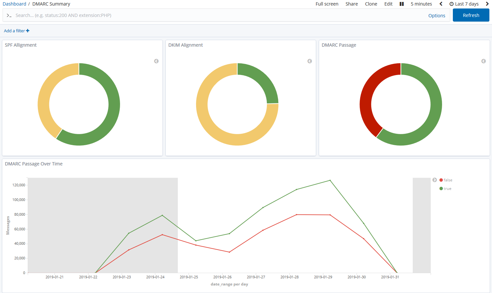

# Parsedmarc: Open source DMARC report analyzer and visualizer

[](https://github.com/nhairs/parsedmarc-fork/actions/workflows/test-suite.yml)
<!-- [](https://pypi.org/project/parsedmarc/) -->
<!-- [](https://pypistats.org/packages/parsedmarc) -->

ParseDMARC is a Python module and CLI utility for parsing DMARC reports.
When used with Elasticsearch and Kibana (or Splunk), it works as a self-hosted
open source alternative to commercial DMARC report processing services such
as Agari Brand Protection, Dmarcian, OnDMARC, ProofPoint Email Fraud Defense,
and Valimail.

!!! danger "This is not the offical documentation"
    **This is not the [official parsedmarc documentation](https://domainaware.github.io/parsedmarc/index.html)**

    **This is an experimental fork utilising a new software architecture. See [GitHub #1](https://github.com/nhairs/parsedmarc-fork/issues/1) for details.**



## Features

- Parses draft and 1.0 standard aggregate/rua reports
- Parses forensic/failure/ruf reports
- Can parse reports from an inbox over IMAP, Microsoft Graph, or Gmail API
- Transparently handles gzip or zip compressed reports
- Consistent data structures
- Simple JSON and/or CSV output
- Optionally email the results
- Optionally send the results to Elasticsearch and/or Splunk, for use with
  premade dashboards
- Optionally send reports to Apache Kafka

## Quick Start

Follow our [Quickstart Guide](quickstart.md) (under contruction).

```python title="TLDR"
# TODO
```

### Migrating to Version `9.0.0`

If you are using an older version of ParseDMARC, We have a handy [migration guide](migrating.md) available.

## License

This project is licensed under the [Apache License 2.0](https://github.com/nhairs/parsedmarc-fork/blob/main/LICENSE).

## Bugs, Feature Requests etc
Please [submit an issue on github](https://github.com/nhairs/parsedmarc-fork/issues).

In the case of bug reports, please help us help you by following best practices [^1^](https://marker.io/blog/write-bug-report/) [^2^](https://www.chiark.greenend.org.uk/~sgtatham/bugs.html).

In the case of feature requests, please provide background to the problem you are trying to solve so that we can a solution that makes the most sense for the library as well as your use case.

## Contributions are Weclome!

Please check out our [Contributors Guide](contributing.md).

## Authors and Maintainers

This project is authored by [Sean Whalen](https://github.com/seanthegeek), [Nicholas Hairs](https://github.com/nhairs), and our wonderful [contributors](https://github.com/nhairs/python-json-logger/graphs/contributors).

It is currently maintained by [Nicholas Hairs](https://github.com/nhairs) ([nicholashairs.com](https://www.nicholashairs.com)).
